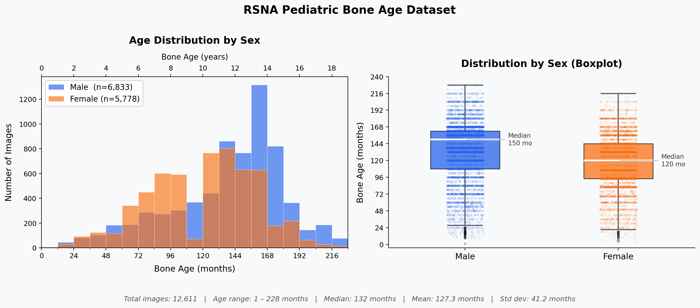
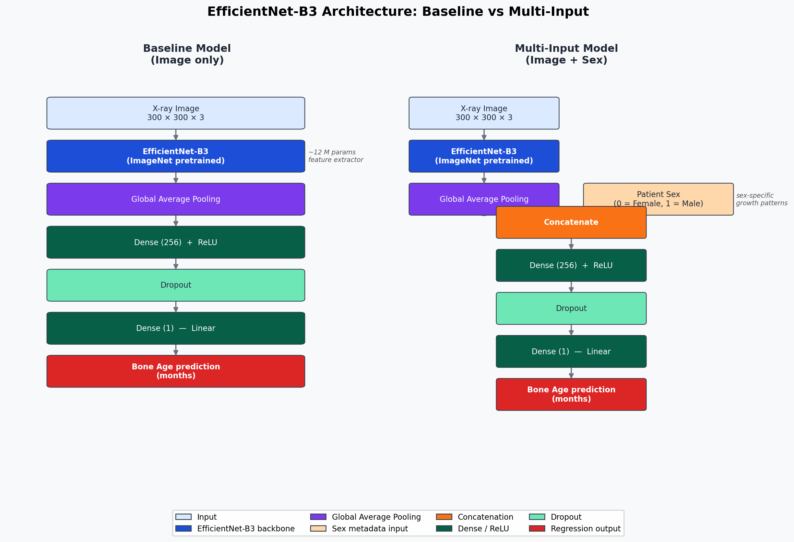
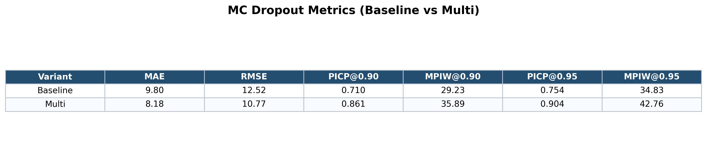
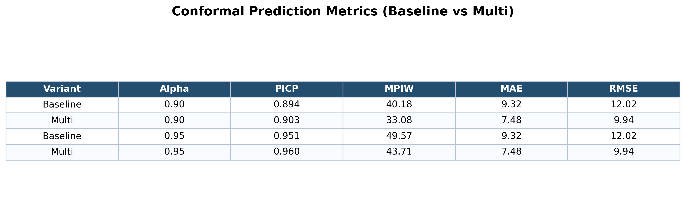
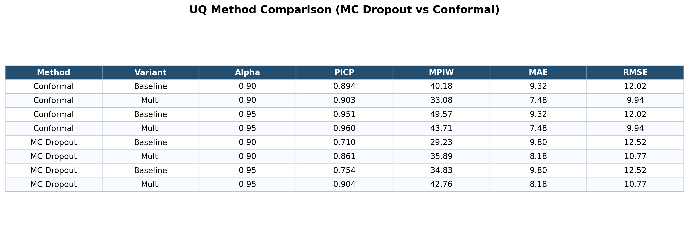
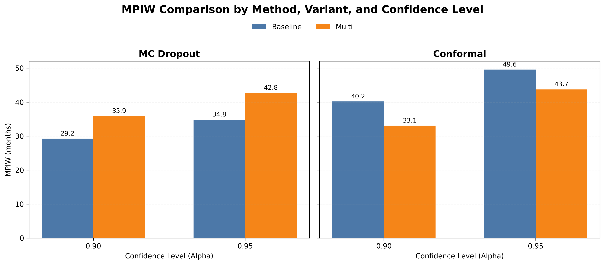

# Pediatric Bone Age Estimation with Uncertainty Quantification

---

## Slide 1 — Title

# Pediatric Bone Age Estimation  
### with Uncertainty Quantification

**Deep learning regression + post-hoc prediction intervals**

> Note: Set the scene briefly — this project builds a model that not only predicts bone age but also tells you how much to trust the prediction.

---

## Slide 2 — Motivation

### Why Automate Bone Age Assessment?

- Pediatric bone age is assessed from hand X-rays to diagnose growth disorders
- Traditional method: a radiologist compares the X-ray to a reference atlas
- **Limitations of the manual approach:**
  - Subjective — inter-observer variability is well-documented
  - Time-consuming — 10–15 minutes per image
  - Inconsistent across institutions and experience levels
- **Goal of this project:**  
  Train a deep learning model to estimate bone age accurately and reliably, with calibrated uncertainty intervals that a clinician can act on

> Note: Emphasize the clinical stakes. An incorrect bone age estimate without any uncertainty indicator is harder to catch and act on than one that signals low confidence.

---

## Slide 3 — Dataset

### RSNA Pediatric Bone Age Dataset

- **Source:** RSNA 2017 competition dataset, publicly available on Kaggle
- **Size:** 12,611 hand X-ray images
- **Labels per image:**
  - `boneage` — true bone age in months (continuous target)
  - `male` — binary sex indicator (True/False)

**Age distribution:**

| Stat | Value |
|---|---|
| Min | 1 month |
| Max | 228 months (19 years) |
| Median | 132 months (11 years) |
| Std Dev | 41.2 months |
| 5th – 95th percentile | 50 – 186 months |

**Sex split:** 54.2% male / 45.8% female (approximately balanced)

**Pre-processing pipeline:**
- Images resized to 300×300 pixels
- EfficientNet-specific normalization applied
- Data augmentation during training: rotation ±20°, translation ±10%, zoom ±10%, brightness variation



> Note: The age distribution is roughly Gaussian centered around age 11. The boxplot shows that males have a higher median (150 months) than females (120 months) — a direct consequence of sex-specific growth timing. Higher errors at the extremes (very young and older adolescents) are expected because those ranges have fewer training examples and more biological variability.

---

## Slide 4 — Model Architecture

### EfficientNet-B3 Regression Models

Both models share the same backbone:

- **ImageNet-pretrained EfficientNet-B3** as a feature extractor
- Global Average Pooling on final feature maps
- Dense(256, activation=ReLU) + Dropout layer
- Single linear output neuron — predicts *normalized* bone age
- Output is re-scaled to months at inference using `max_age` from the training split

**Two variants:**



**Why add sex?**  
Skeletal maturation rates differ between males and females. Concatenating the sex indicator lets the network learn sex-specific growth patterns alongside visual cues.

**Data split (stratified by sex, seed=42):**
- 80% training (≈10,088 images)
- 10% validation (≈1,262 images) — also used as calibration set for conformal prediction
- 10% test (≈1,262 images)

**Training details:** Loss = MAE, Optimizer = Adam, Batch size = 32, early stopping + LR scheduling, model checkpointing

> Note: The Dropout layer built into the model head is the same one repurposed for MC Dropout inference later — no architectural change is needed.

---

## Slide 5 — Regression Results

### Point Prediction Performance

| Model | MAE (months) | RMSE (months) | R² |
|---|---|---|---|
| Baseline (image only) | 4.47 | 5.78 | 0.90 |
| Multi-Input (image + sex) | **3.82** | **4.98** | **0.917** |

**Key observations:**
- Adding sex reduces MAE by ~15% (4.47 → 3.82 months)
- ~80% of predictions fall within ±6 months of the true age
- ~98% of predictions fall within ±12 months of the true age
- Error distribution is approximately Gaussian, centered near zero
- Larger errors observed at very young ages and older adolescents (sparse training data, higher biological variability)

> Note: These are training evaluation numbers. The UQ evaluation in later slides uses the same test split and shows slightly different MAE/RMSE because the inference pipeline re-runs the model. The direction is consistent: Multi-Input is always better on point accuracy.

---

## Slide 6 — Why Uncertainty Quantification?

### From Point Predictions to Trustworthy Intervals

A point prediction answers: *"What is the estimated bone age?"*

**But a clinician also needs to know:** *"How confident should I be in this estimate?"*

| Prediction | Clinical interpretation |
|---|---|
| 132 months | Model says 11 years — but how reliable is this? |
| 132 ± 16 months (90% CI) | True age is between 116–148 months with 90% confidence |

**Uncertainty quantification (UQ) answers:**
- Which predictions are reliable vs uncertain?
- What range covers the true age at a given probability?

**Two UQ methods applied in this project:**
1. **Monte Carlo Dropout** — model-based, uses stochastic inference
2. **Split Conformal Prediction** — data-driven, uses calibration residuals

> Note: Both methods are *post-hoc* — applied to the already-trained model without retraining.

---

## Slide 7 — UQ Method 1: Monte Carlo Dropout

### Uncertainty from Stochastic Inference

**Standard Dropout:** active during training, off at inference  
**MC Dropout (Gal & Ghahramani, 2016):** keep dropout *on* at inference

**How it works:**

1. For each test image, run the model **T = 50 forward passes** with dropout active
2. Each pass randomly zeros different neurons → slightly different prediction
3. Collect 50 predictions: `[ŷ₁, ŷ₂, ..., ŷ₅₀]`
4. **Mean** of the 50 passes = final bone age estimate
5. **Standard deviation** of the 50 passes = uncertainty estimate

**Construct interval at confidence level α:**

```
lower = mean − z(α) × std
upper = mean + z(α) × std
```

where `z(α)` is the Gaussian z-score for the desired confidence level (e.g., z = 1.645 for 90%, z = 1.960 for 95%).

**Key property:** uncertainty comes entirely from the model's internal structure (the dropout pattern). No separate calibration step is needed.

**Limitation:** there is no guarantee that the interval width reflects actual prediction errors — the model can be overconfident or underconfident.

> Note: The model architecture already has a Dropout layer in the head. The MC Dropout script calls `model(inputs, training=True)` to keep it stochastic, then batches the 50 passes efficiently using tensor tiling.

---

## Slide 8 — UQ Method 2: Split Conformal Prediction

### Calibrated Intervals with Coverage Guarantees

Split conformal prediction is a **post-hoc, distribution-free** method that constructs intervals with a provable finite-sample coverage guarantee.

**How it works (3 steps):**

**Step 1 — Calibrate on validation set (n = 1,261 images):**
```
residuals = |y_true − y_pred|  for each validation image
```

**Step 2 — Compute the conformal quantile:**
```
k = ceil((n + 1) × α)
q_hat = k-th smallest residual
```

For example, at α = 0.90 on the baseline model, `q_hat = 20.09 months`.

**Step 3 — Build test intervals:**
```
lower = y_pred − q_hat
upper = y_pred + q_hat
```

**Coverage guarantee:**  
Under the exchangeability assumption, at least α fraction of test samples will have their true age inside the interval — regardless of the model or data distribution.

**Key property:** the interval width is determined by actual model errors on held-out data, not by the model's internal uncertainty estimate.

> Note: Because q_hat is a single scalar derived from the calibration set, every test image gets the same interval width for a given model and alpha. This is the main limitation compared to adaptive methods.

---

## Slide 9 — UQ Metrics: PICP and MPIW

### How to Measure Interval Quality

Two complementary metrics evaluate prediction intervals:

---

**PICP — Prediction Interval Coverage Probability**

```
PICP = fraction of test samples where:  lower ≤ y_true ≤ upper
```

- Target: PICP ≥ α (e.g., ≥ 0.90 for a 90% interval)
- If PICP < α: intervals are too narrow — **overconfident**
- If PICP >> α: intervals are too wide — **over-conservative**

---

**MPIW — Mean Prediction Interval Width**

```
MPIW = mean(upper − lower)  across all test images  (in months)
```

- Want this as **small as possible** while still achieving target PICP
- A narrow interval that covers the true value is more informative to a clinician

---

**The tension between the two:**

| MPIW | PICP | Interpretation |
|---|---|---|
| Very wide | High | Safe but uninformative |
| Very narrow | Low | Precise but unreliable |
| Narrow | ≥ α | Ideal |

> Note: Think of it as a precision-recall tradeoff. PICP is reliability; MPIW is usefulness. A good UQ method achieves target PICP with the smallest possible MPIW.

---

## Slide 10 — MC Dropout Results

### MC Dropout is Overconfident



| Variant | MAE | RMSE | PICP @ 0.90 | MPIW @ 0.90 | PICP @ 0.95 | MPIW @ 0.95 |
|---|---|---|---|---|---|---|
| Baseline | 9.80 | 12.52 | **0.710** | 29.23 | **0.754** | 34.83 |
| Multi | 8.18 | 10.77 | 0.861 | 35.89 | **0.904** | 42.76 |

**Observations:**

- **Baseline is severely overconfident.** At nominal 90%, actual coverage is only 71.0% — the model is asserting much more confidence than it can justify. At nominal 95%, coverage is only 75.4%.
- **Multi-input improves coverage** (86.1% at α=0.90; 90.4% at α=0.95), but still falls short at the 90% level.
- MC Dropout interval widths (29–43 months) are *narrower* than conformal — but they fail to cover the true age often enough to meet the nominal level.
- The multi-input model has a **higher mean predictive std** (10.9 months) than baseline (8.9 months), which is why its MC Dropout intervals are wider despite better point accuracy.

> Note: Overconfidence in MC Dropout typically occurs because dropout-based uncertainty reflects the model's internal variability, not its actual prediction errors on the data. It is a relative signal, not an absolutely calibrated one.

---

## Slide 11 — Conformal Prediction Results

### Conformal Prediction Meets Its Coverage Targets



| Variant | α | PICP | MPIW (months) | MAE | RMSE |
|---|---|---|---|---|---|
| Baseline | 0.90 | 0.894 | 40.18 | 9.32 | 12.02 |
| Multi | 0.90 | **0.903** | **33.08** | 7.48 | 9.94 |
| Baseline | 0.95 | 0.951 | 49.57 | 9.32 | 12.02 |
| Multi | 0.95 | **0.960** | **43.71** | 7.48 | 9.94 |

**Observations:**

- **Both variants meet their nominal coverage targets** at both α = 0.90 and α = 0.95 — this is the conformal guarantee in practice.
- **Multi-input is strictly better on both dimensions:** higher coverage *and* narrower intervals than baseline at every alpha.
- The narrower intervals for multi-input are explained by the calibration step: the better point predictions produce smaller residuals on the validation set, which pushes `q_hat` down (20.09 → 16.54 months at α=0.90), leading to a 7-month reduction in interval width.
- Width increases as α increases (40.18 → 49.57 for baseline) — expected, since higher confidence requires wider intervals.

> Note: The `q_hat` values are the conformal threshold computed from the validation residuals: 20.09 months (baseline, α=0.90), 24.78 months (baseline, α=0.95), 16.54 months (multi, α=0.90), 21.86 months (multi, α=0.95). MPIW = 2 × q_hat since intervals are symmetric.

---

## Slide 12 — Combined Comparison

### Method × Variant × Coverage Level





**Reading the MPIW bar chart:**

- **MC Dropout (left panel):** Multi has *wider* intervals than Baseline at both alpha levels (35.9 vs 29.2 at α=0.90). Counter-intuitive at first — but the multi-input model has higher predictive standard deviation (10.9 vs 8.9 months), so its Gaussian intervals are wider.
- **Conformal (right panel):** Multi has *narrower* intervals than Baseline (33.1 vs 40.2 at α=0.90). This makes sense: better point predictions → smaller calibration residuals → smaller q_hat → tighter intervals.

**Coverage vs Width tradeoff summary:**

| Method | Variant | α=0.90 PICP | α=0.90 MPIW |
|---|---|---|---|
| MC Dropout | Baseline | 0.710 ❌ | 29.23 |
| MC Dropout | Multi | 0.861 ❌ | 35.89 |
| Conformal | Baseline | 0.894 ✓ | 40.18 |
| **Conformal** | **Multi** | **0.903 ✓** | **33.08** |

**Best overall: Conformal + Multi-input** — the only combination that achieves target coverage with the smallest interval width.

> Note: The difference in MPIW behavior between the two methods reflects a fundamental difference in design: MC Dropout width is driven by the model's internal stochasticity; conformal width is driven by the model's actual errors on held-out data.

---

## Slide 13 — Key Takeaways

### Summary

1. **Adding sex metadata consistently improves the model.** MAE drops ~15% and conformal intervals narrow by ~7 months at 90%.

2. **Conformal prediction reliably achieves its stated coverage.** Both variants meet their targets at α=0.90 and α=0.95. This is a provable property under exchangeability.

3. **MC Dropout is overconfident**, especially for the baseline model. At nominal 95%, actual coverage is only 75.4%. Intervals are narrower on paper but fail to contain the true age often enough.

4. **The best combination is Conformal + Multi-input:** 90.3% coverage with 33.1-month intervals at α=0.90 — reliably calibrated and as tight as possible.

5. **MC Dropout is still useful as a relative signal.** Even if its absolute coverage is off, the standard deviation scores can rank predictions by reliability (high std = uncertain image).

6. **Conformal intervals are fixed-width per alpha.** Every test image gets the same interval — not adaptive to image difficulty. This is the main limitation.

---

## Slide 14 — Limitations and Future Work

### What This Project Does Not (Yet) Do

**Current limitations:**

- No hand segmentation — background noise and cropping artifacts can degrade predictions; the model sees the full image including non-bone regions
- Only sex is used as structured metadata — clinically relevant factors like height, weight, ethnicity, and pubertal staging are not incorporated
- Conformal intervals are symmetric and non-adaptive — every image gets the same width at a given confidence level, regardless of image quality or age range
- Higher errors at extreme ages (very young infants, older adolescents) are not addressed

**Future directions:**

- **Segmentation pre-processing:** Use a U-Net to isolate the hand region before feeding into EfficientNet
- **Richer metadata:** Incorporate height, weight, and other clinical variables as additional inputs
- **Adaptive conformal prediction:** Mondrian conformal or locally-weighted conformal methods to produce image-specific interval widths
- **Hybrid architectures:** CNN + Transformer models (e.g., ViT) for richer feature extraction
- **Deployment:** Wrap the model as a REST API (FastAPI) for real-world clinical integration

---

*Prepared for: [Course / Presentation Name]*  
*Dataset: RSNA Pediatric Bone Age (Kaggle)*  
*Models: EfficientNet-B3 (TensorFlow/Keras)*  
*UQ methods: MC Dropout (Gal & Ghahramani, 2016) · Split Conformal Prediction*
